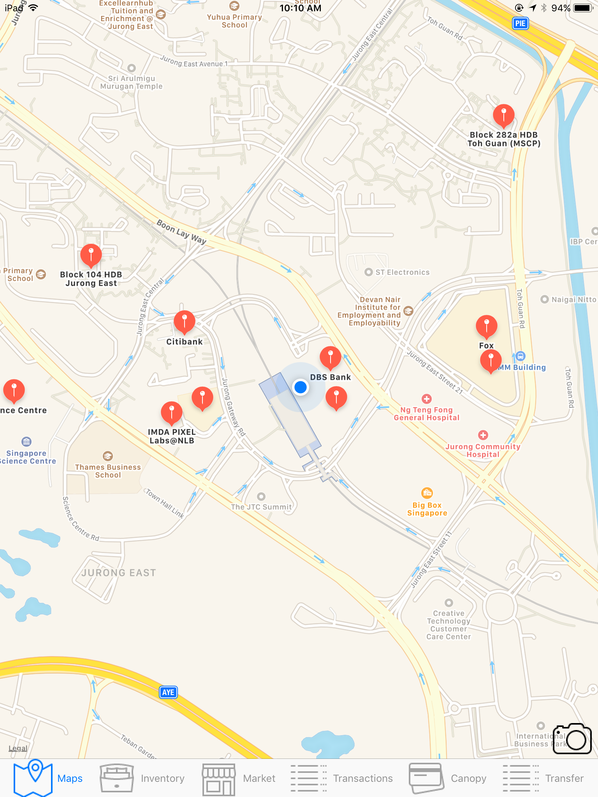
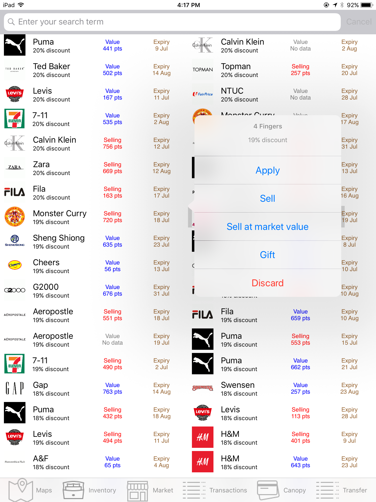
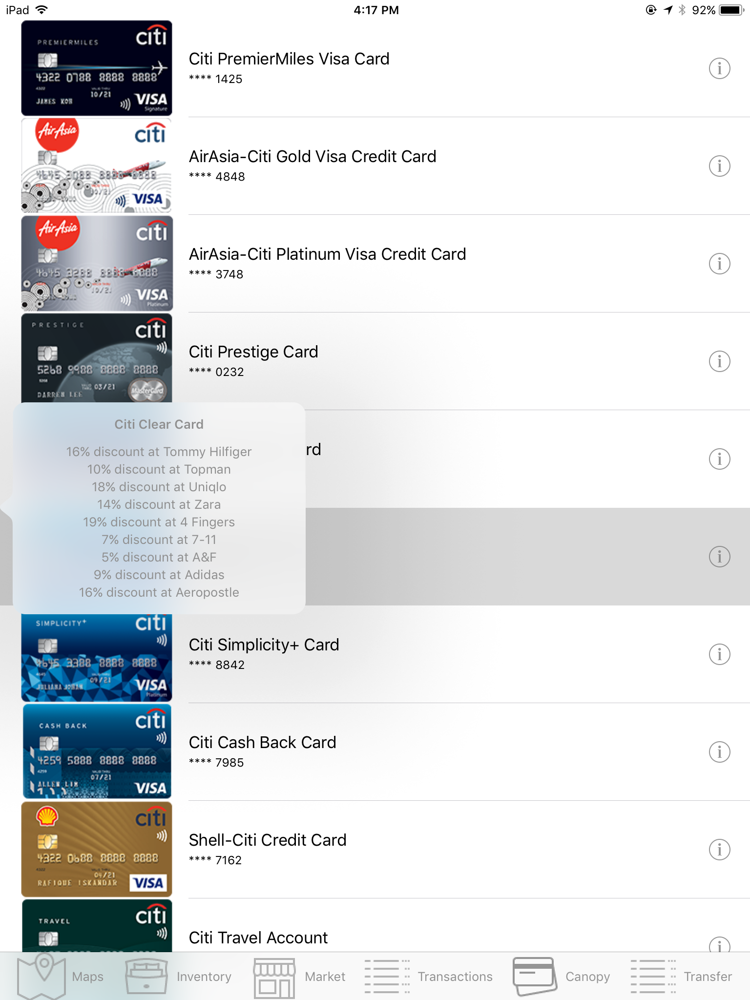
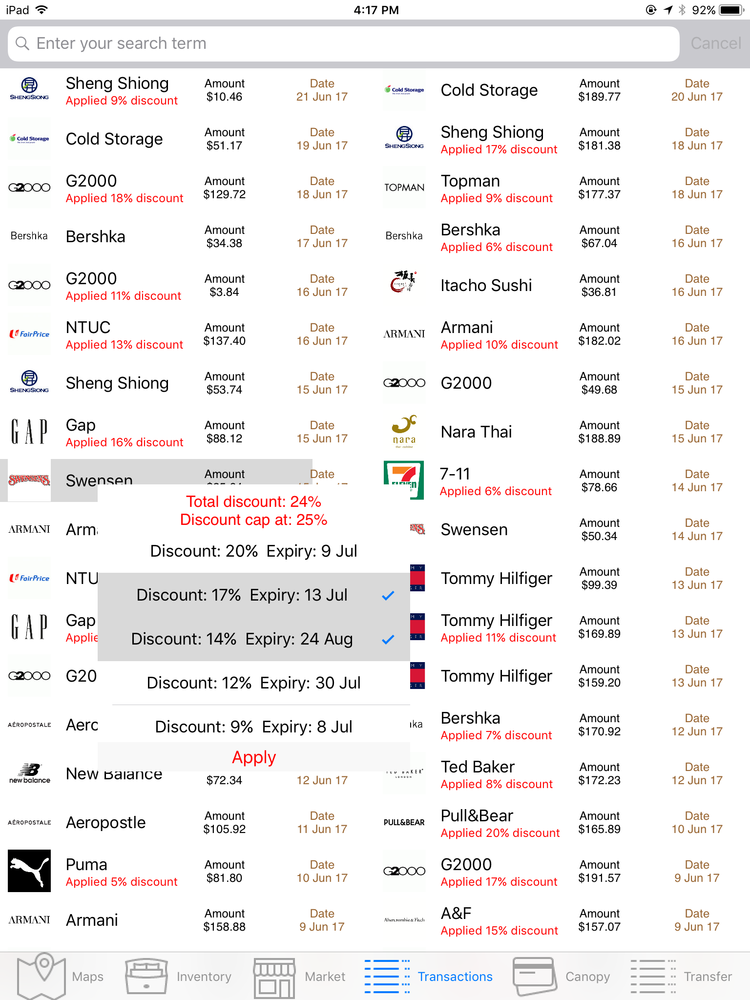
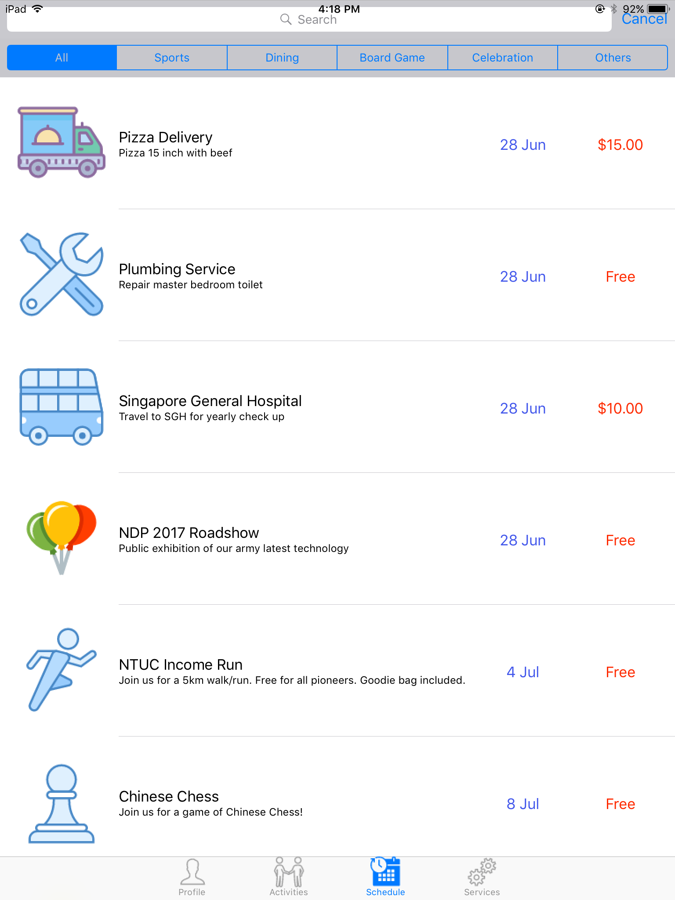
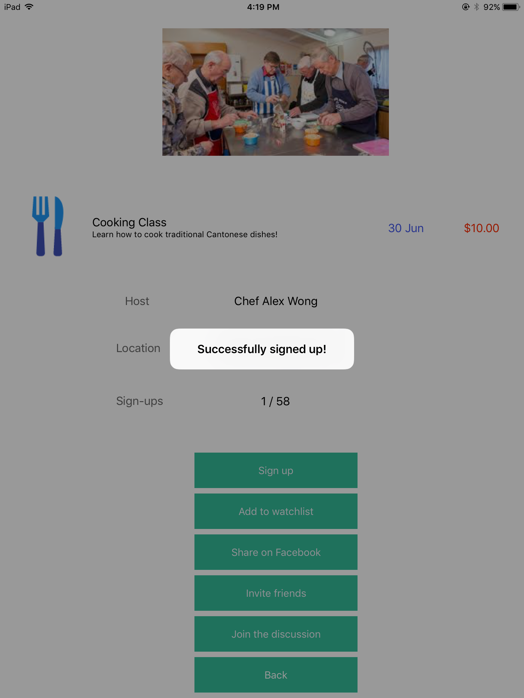
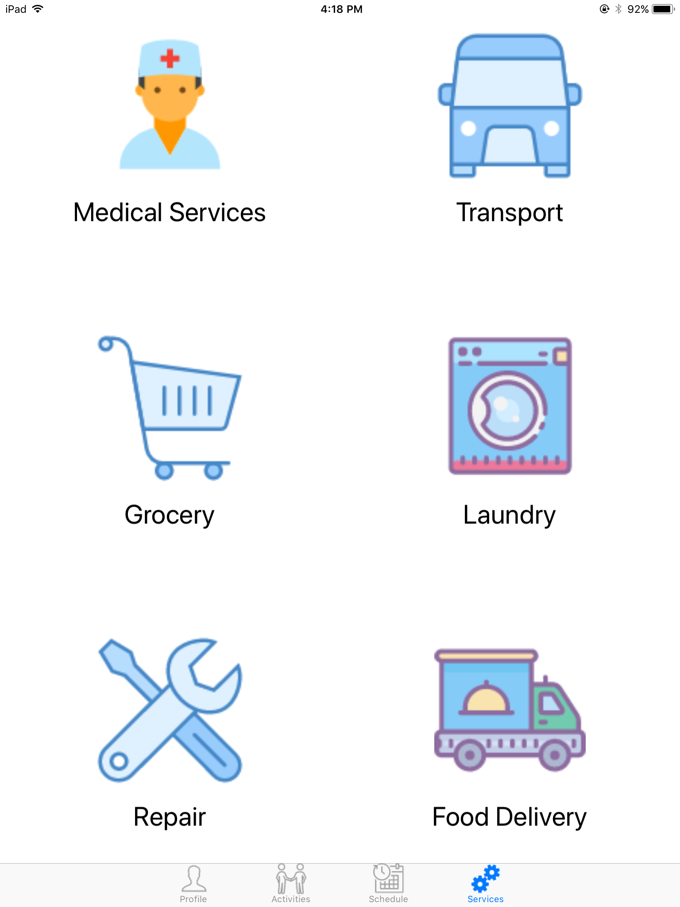

# Overview
This is a compilation of prototypes I created for hackathons etc.
Code quality is expectedly terrible here...

# augmented-reality-banking
Banking app utilising augmented reality.

  
  

# Elderler
AIO helper app for senior citizens.

  

# smart-lift
Lift system that displays waiting time and remaining capacity. Efficient management of lift resources (Eg. skips floors when full capacity).